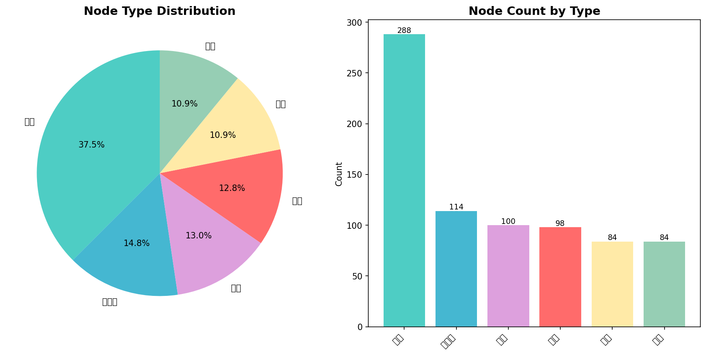
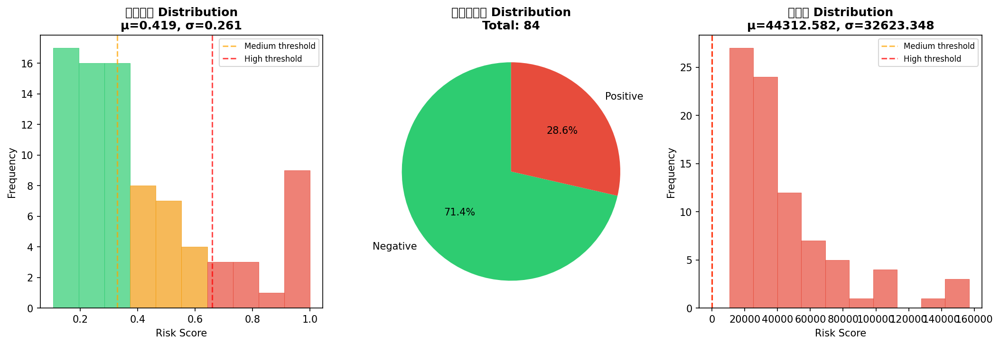
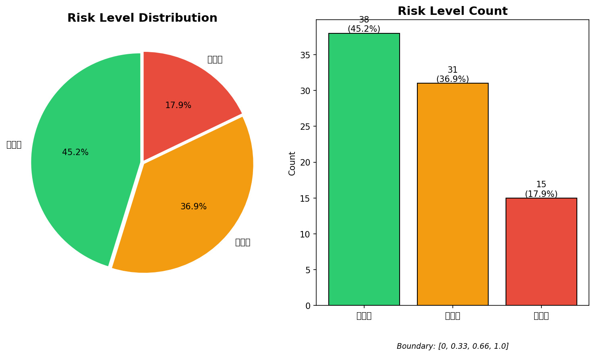
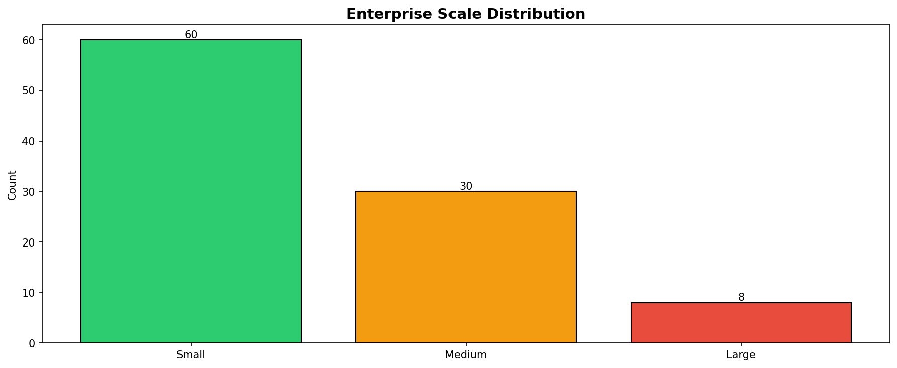
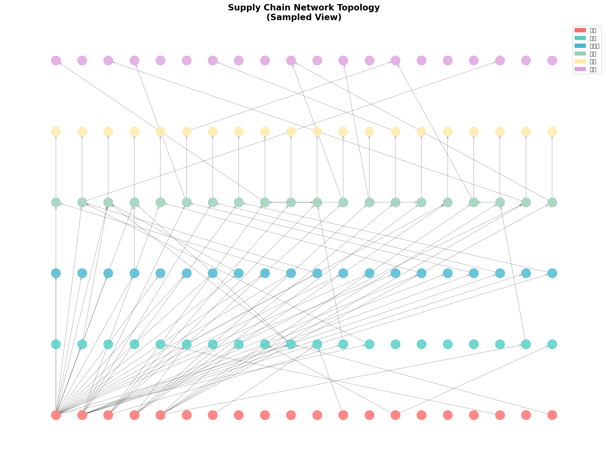
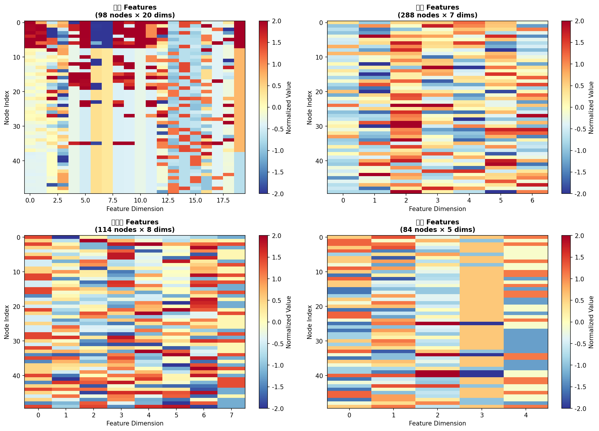
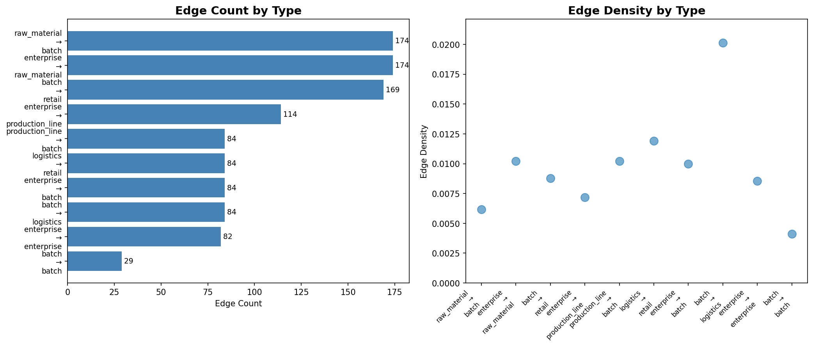

# 供应链异构图数据质量报告

**生成时间**: 2026-03-17 09:54:38

---

## 1. 数据概览

### 1.1 图基本统计

- **总节点数**: 768
- **总边数**: 1078
- **节点类型数**: 6
- **边类型数**: 10
- **整体密度**: 0.0088
- **平均度数**: 2.81

## 2. 节点分布分析

| 节点类型 | 数量 | 占比 | 特征维度 | 缺失率 |
|---------|------|------|---------|--------|
| raw_material | 288 | 37.5% | 7 | 6.10% |
| production_line | 114 | 14.8% | 8 | 0.00% |
| retail | 100 | 13.0% | 6 | 14.50% |
| enterprise | 98 | 12.8% | 20 | 17.65% |
| batch | 84 | 10.9% | 5 | 1.67% |
| logistics | 84 | 10.9% | 7 | 32.48% |

## 3. 边分布分析

| 边类型 | 数量 | 占比 | 密度 |
|--------|------|------|------|
| enterprise → raw_material | 174 | 16.1% | 0.0062 |
| raw_material → batch | 174 | 16.1% | 0.0072 |
| batch → retail | 169 | 15.7% | 0.0201 |
| enterprise → production_line | 114 | 10.6% | 0.0102 |
| production_line → batch | 84 | 7.8% | 0.0088 |
| enterprise → batch | 84 | 7.8% | 0.0102 |
| batch → logistics | 84 | 7.8% | 0.0119 |
| logistics → retail | 84 | 7.8% | 0.0100 |
| enterprise → enterprise | 82 | 7.6% | 0.0085 |
| batch → batch | 29 | 2.7% | 0.0041 |

## 4. 数据完整性评分

### 4.1 评分详情

| 维度 | 得分 | 满分 | 说明 |
|------|------|------|------|
| Node Completeness | 25.0 | 25 | 包含6/6种节点类型 |
| Edge Completeness | 25.0 | 25 | 包含10/10种边类型 |
| Feature Completeness | 22.0 | 25 | 平均缺失率: 12.07% |
| Label Completeness | 25.0 | 25 | 包含3种风险标签 |

### 4.2 总评分: 97.0/100

**等级**: A (优秀)

## 5. 缺失值统计

- **总体缺失率等级**: B (良好)
- **平均缺失率**: 12.07%

### 5.1 缺失值处理建议

- ℹ️ enterprise: 缺失率中等(17.7%)，可考虑插值填充
- ⚠️ logistics: 缺失率较高(32.5%)，建议检查数据源
- ℹ️ retail: 缺失率中等(14.5%)，可考虑插值填充

## 6. 风险标签分布

### 6.1 二分类标签

- **正样本**: 24 (28.57%)
- **负样本**: 60 (71.43%)
- **平衡分数**: 0.57

### 6.2 风险等级分桶

| 风险等级 | 数量 | 占比 |
|---------|------|------|
| 低风险 | 38 | 45.2% |
| 中风险 | 31 | 36.9% |
| 高风险 | 15 | 17.9% |

### 6.3 标签平衡性警告

- ℹ️ 二分类标签轻微不平衡: 阳性率=28.57%

## 7. 可视化图表

### node_distribution.png

### risk_distribution.png

### risk_buckets.png

### scale_risk_relation.png

### network_topology.png

### feature_heatmap.png

### edge_statistics.png

## 8. 总结与建议

✅ **数据质量优秀** - 数据完整、标签平衡，可直接用于模型训练

- 考虑使用均值/中位数填充或更复杂的插值方法处理缺失值
- 使用SMOTE等过采样技术或调整类别权重处理标签不平衡

---

*报告由 DairyRisk 数据分析模块自动生成*